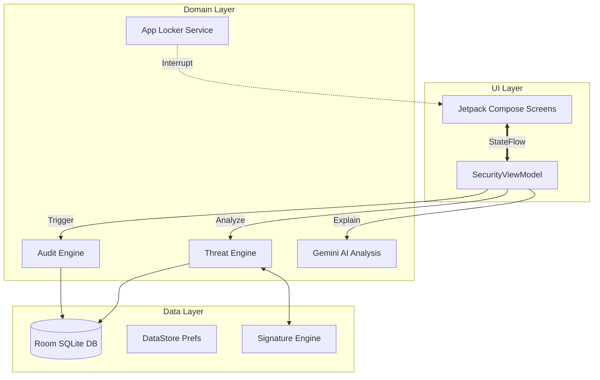

<div align="center">

<br/>
<br/>

# 🛡️ V I G I L A N T &nbsp; G U A R D

<br/>

> **A Next-Generation, Multi-Layered Cyber-Security Engine for Android** <br/>
> *Empowering devices with AI-driven threat intelligence, extreme-speed signature scanning, and real-time active defense.*

<br/>

[](https://github.com/PRACHI1284/cyber-security-project-/actions)
[](https://www.android.com/)
[](https://kotlinlang.org/)
[](https://developer.android.com/jetpack/compose)

</div>

<br/>

<div align="center">
  
</div>

---

## ✨ Features (The 5 Pillars of Defense)

| <kbd>01</kbd> AI-Powered Threat Analysis | <kbd>02</kbd> Real-Time Background Protection | <kbd>03</kbd> Dark Web Scanner |
| :--- | :--- | :--- |
| Integrated with **Gemini AI**, complex security threats are broken down into plain language. A dynamic "Explain" engine gives users actionable insights on detected malware and heuristic risks. | A persistent foreground service (`ACTION_PACKAGE_ADDED`) that monitors system installations and file changes in real-time. Instantly catches and flags suspicious payloads before they execute. | Connects to threat intelligence networks (e.g., HIBP protocols) to verify if the user's credentials have been compromised in known global data breaches. |

| <kbd>04</kbd> OS Security Audit | <kbd>05</kbd> Zero-Trust App Locker |
| :--- | :--- |
| Deep system introspection engine checking for OS-level vulnerabilities: Root access bypass, Developer Options exposure, ADB debugging loopholes, and Unknown Source installations. | Accessibility-service driven overlay that detects when protected apps (e.g., WhatsApp, Banking apps) are launched and enforces a secure biometric/PIN lock screen. |

<br/>

## 🧬 Technical Workflow & Architecture

Vigilant Guard operates using a reactive, unidirectional data flow built on modern Android Architecture (MVVM + StateFlow).



<br/>

## 🧱 Core Data Structures & Algorithms

To achieve extreme performance and minimal battery drain during background scanning, VigilantGuard utilizes specialized, highly-optimized data structures.

### <kbd>A</kbd> Aho-Corasick Automaton (Signature Engine)
Instead of checking thousands of known malicious package signatures iteratively ($O(N \times M)$), our Aho-Corasick engine builds a **Trie (Prefix Tree)** with failure links. This allows the scanner to process target applications against **all** signatures simultaneously.
* **Time Complexity**: $O(N + M)$ where $N$ is the length of the scanned file/text and $M$ is the combined length of all signatures.

### <kbd>B</kbd> Bloom Filters (Probabilistic Gateway)
Before initiating the intensive Aho-Corasick automaton, apps pass through a highly optimized Bloom Filter.
* **Mechanism**: A bit array of $m$ bits with $k$ different hash functions.
* **Advantage**: Quickly discards 99% of safe applications with a time complexity of $O(k)$. False positives proceed to the Aho-Corasick engine for verification, but false negatives are impossible.

### <kbd>C</kbd> Directed Acyclic Graphs (DAG) for Heuristics
When analyzing application permissions (e.g., `READ_SMS` + `INTERNET`), the app maps them into a DAG to dynamically generate risk scores. If a path exists between sensitive data access and network egress, the risk score multiplies exponentially.

<br/>

## 🛠️ Build & Installation

> [!IMPORTANT]
> The app requires **Android SDK 34** and utilizes modern features like Foreground Services (`specialUse`) and Accessibility Services.

1. **Clone the repository:**
   ```bash
   git clone https://github.com/Detox10/cyber-security-project-.git
   cd cyber-security-project-
   ```

2. **Environment Variables:**
   Create a `local.properties` file in the root directory and add your Gemini API Key:
   ```properties
   GEMINI_API_KEY=your_api_key_here
   ```

3. **Build:**
   Open the project in **Android Studio (Koala or newer)** and hit `Run` (Shift + F10). No local `debug.keystore` is required; AGP will generate one automatically.

<br/>

## 🛡️ CI/CD & Automation

This project is fully integrated with **GitHub Actions**. Every commit to the `main` branch automatically triggers a fresh Android APK build using JDK 17. 
* You can download the latest compiled `app-debug.apk` directly from the [Actions Tab](https://github.com/PRACHI1284/cyber-security-project-/actions).

---
<div align="center">
<i>Securing the mobile frontier, one device at a time.</i> <br/>
Developed with 💙 by <b>P R A C H I</b> and contributors.
</div>
